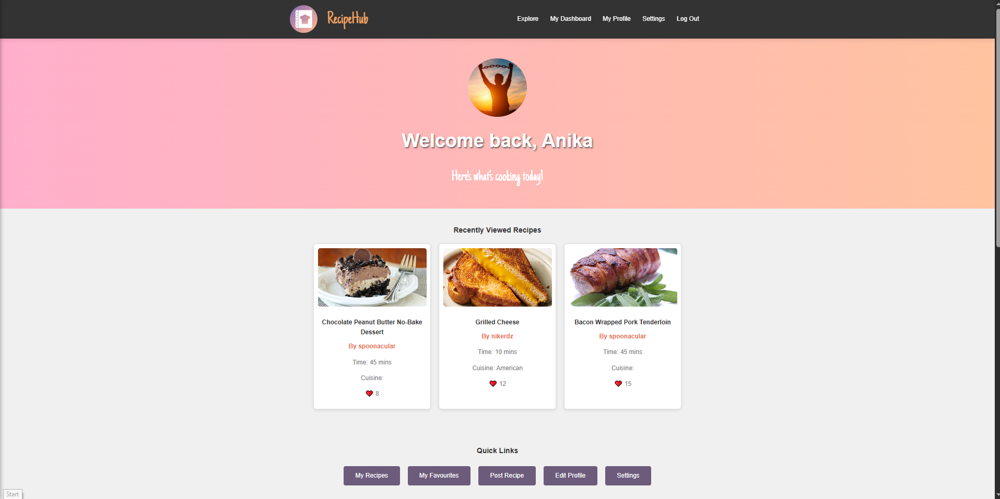
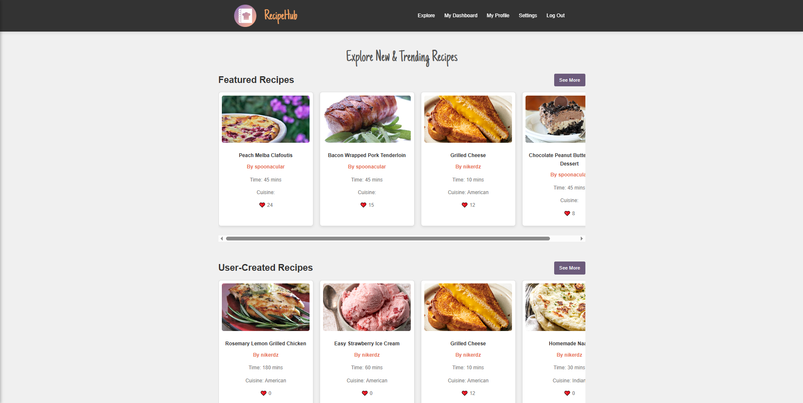
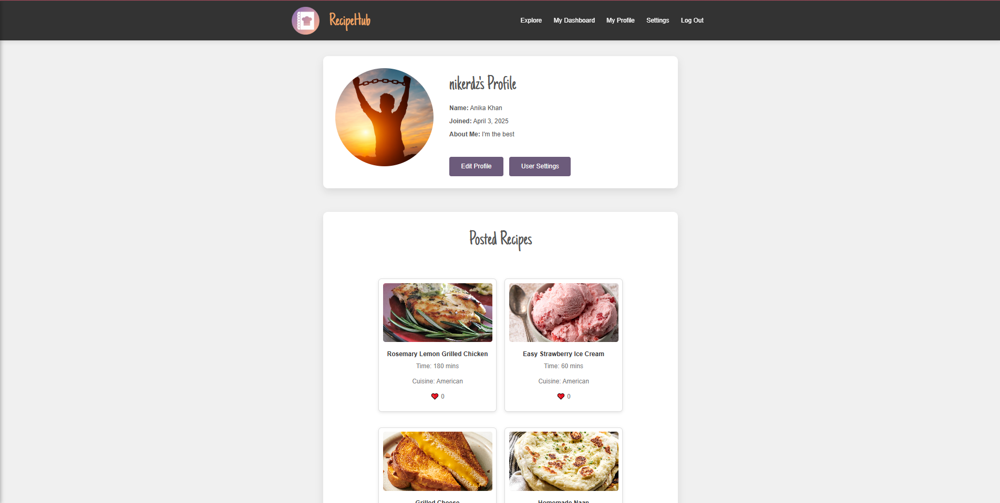

# COMP-3077-Final-Project

# RecipeHub

RecipeHub is a dynamic web platform that allows users to discover, upload, manage, and share recipes with others. Whether you're a casual cook or a culinary enthusiast, RecipeHub lets you create your own digital cookbook while exploring dishes from around the world.

## Features

- 👤 User registration, login, and profile customization
- 📋 Add, edit, and delete your own recipes
- 🔍 Explore page powered by Spoonacular API
- ❤️ Favorite recipes and view them on your profile
- 💬 Comment on others’ recipes
- 📊 Admin dashboard with monitoring tools
- 🎨 Multiple site themes (Pink, Blue, Green)
- 📚 Wiki with documentation, user guides, and FAQs

## 🛠 Technologies Used

- HTML5 / CSS3 / JavaScript
- PHP (vanilla, procedural)
- MySQL + PDO
- Chart.js (for graphs)
- Spoonacular API

## Gallery

